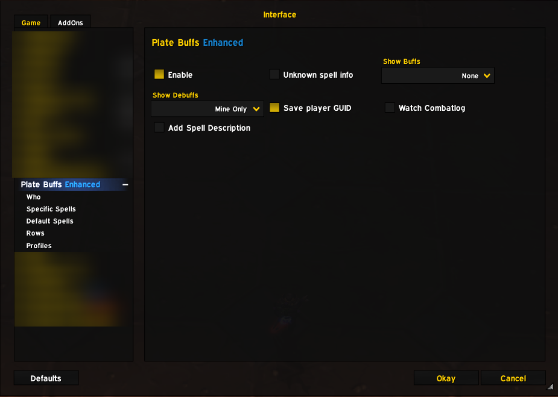
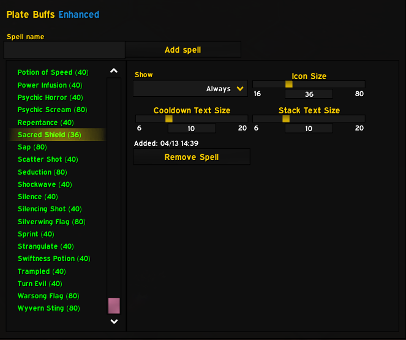
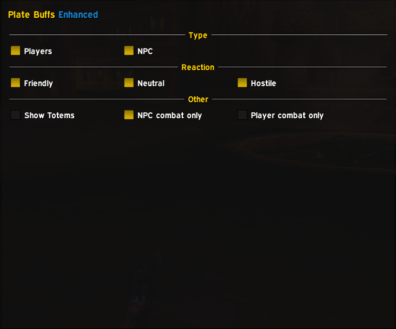
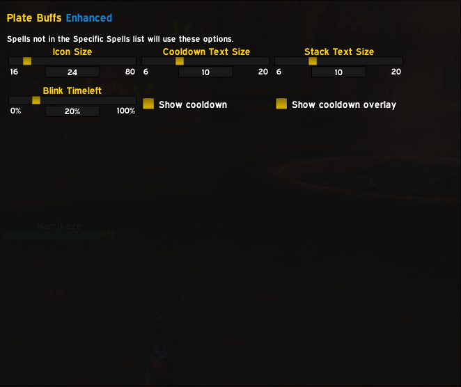
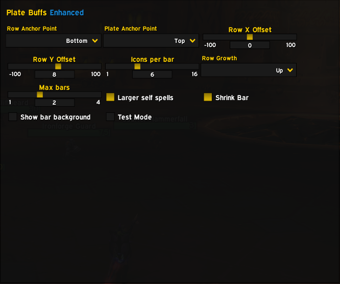

# PlateBuffs Enhanced

## ⚡ Disclaimer

**This addon is 100% vibe coded with 0 understanding of what is going on.** It works, the debuffs display, features function—but if you ask how or why, the honest answer is "I have no idea". Proceed at your own risk and with the understanding that this is powered purely by intuition and trial-and-error.

## ⚠️ Compatibility

**This addon is designed for [Awesome WotLK](https://github.com/FrostAtom/awesome_wotlk) only.** It uses the modern C_NamePlate API which is specific to this version and will not work with other WoW versions or private servers that don't support these APIs.

### Requirements
- [Awesome WotLK](https://github.com/FrostAtom/awesome_wotlk) client installed

## Features

- **Display Enemy Debuffs**: See harmful auras applied to enemy nameplates at a glance
- **Display Friendly Buffs**: See helpful auras on friendly nameplates
- **Customizable Spell Lists**: Add specific spells you want to track
- **Icon Sizing**: Adjust icon sizes for different spells
- **Stack Counts**: Display aura stack counts
- **Cooldown Indicators**: Show remaining duration with visual cooldown sweeps
- **Show/Hide Controls**: Choose which debuffs to display (all, your own only, or none)

## Installation

1. Download or clone the addon folder
2. Extract to your WoW Addons folder:
   ```
   World of Warcraft/Interface/AddOns/PlateBuffsEnhanced/
   ```
3. Restart World of Warcraft or reload the UI
4. Type `/pb` in-game to open the configuration panel

## Commands

| Command | Description |
|---------|-------------|
| `/pb` | Open configuration panel |
| `/pb debug` | Show debug information about tracked nameplates |
| `/pb test` | Test nameplate detection |

## Screenshots

### Main Configuration Panel
Main interface showing global addon settings, debuff display options, and quick access to other configuration pages.



### Specific Spells Configuration
Customize how individual spells are displayed with per-spell settings for icon size, cooldown display, and stack counts.



### Target Type Filtering
Configure which types of units to display auras for (Players, NPCs, Friendly, Neutral, Hostile).



### Default Spells Configuration
Default settings applied to all spells not in the Specific Spells list, including icon sizing and cooldown display options.



### Row Layout Configuration
Configure how auras are arranged on nameplates with options for bar positioning, spacing, and maximum bars.



## Configuration

### Main Options

- **Default Debuff Show Mode**: Choose what debuffs to display globally
  - All: Show all debuffs (default for testing)
  - Mine Only: Show only debuffs you cast
  - None: Hide all debuffs

- **Icon Settings**:
  - Icon Size: Default 24 pixels
  - Cooldown Timer Size: Default 14 pixels
  - Stack Count Size: Default 14 pixels

- **Bar Layout**:
  - Number of bars: How many rows of icons to display
  - Icons per bar: How many icons per row

### Spell-Specific Options

Add spells to "Specific Spells" section to customize their display:

1. Type a spell name in the input field
2. Click "Add spell"
3. Configure:
   - **Show Mode**: When to display this spell (All/Mine Only/Never)
   - **Icon Size**: Custom size for this spell's icon
   - **Cooldown Size**: Custom size for cooldown timer
   - **Stack Size**: Custom size for stack count display

## How It Works

1. **Nameplate Detection**: Hooks into WoW's NAME_PLATE_UNIT_ADDED event to track enemy/friendly nameplates
2. **Aura Scanning**: Uses UnitAura() API to query buffs and debuffs for each nameplate unit
3. **Frame Creation**: Dynamically creates texture frames above nameplates for each aura
4. **Filtering**: Applies your configured show/hide rules to determine which auras display
5. **Updates**: OnUpdate hooks refresh aura status and remove expired auras

### UnitAura API (Awesome WotLK)

The addon uses the UnitAura() function with the following return values:

```lua
name, rank, icon, count, dispelType, duration, expirationTime, unitCaster, isStealable, shouldConsolidate, spellId = UnitAura(unit, index, "HELPFUL|HARMFUL")
```

Note the `rank` field at position 2 - this is specific to this WoW version and shifts the icon texture path to position 3.

## Troubleshooting

### Debuffs not showing
- Check your Default Debuff Show Mode in options (`/pb`)
- Verify you're in combat or targeting a unit with auras
- Try `/pb debug` to see if auras are being detected

### Icons appear as black boxes
- Ensure spell data is being read correctly
- Check that LibAuraInfo is loaded properly
- Verify the spell exists in the WoW spell database

### Addon won't load
- Confirm you're using Awesome WotLK
- Check that all library files are present in the `libs/` folder
- Look in the chat for any Lua errors

## License

This addon is provided as-is for Awesome WotLK community use.

## Support

For issues or feature requests, please refer to the development documents included in this addon folder.
